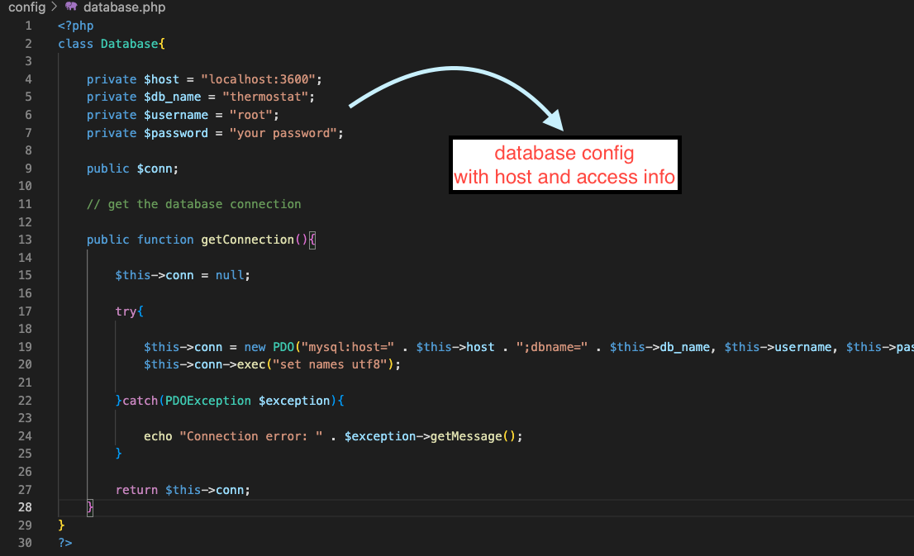

# php-rest-api-thermostat
PHP Rest API codebase with Thermostat
!! No Frameworks !!

My primary focus has been on constructing the REST API using PHP. During the development process, I worked on establishing connections with thermostats via APIs. These APIs were designed to facilitate various functionalities, including reading thermostat information, creating new thermostats, and editing temperature settings.

For detailed insights into the thermostat information and functionalities, you can refer to [this site](https://www.britannica.com/technology/thermostat)

# Installation

## configuration database connection
- ./config/database.php 

- create database

## run
- put the code on htdocs directory of XAMPP
- run XAMPP
